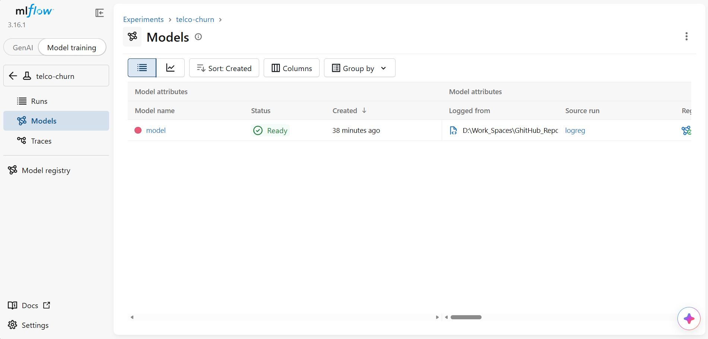

# MLOps-Customer-Churn-Pipeline
Customer churn model with a full MLOps pipeline: DVC, MLflow, pandera, pytest, GitHub Actions, Docker, FastAPI, drift monitoring.  Note: this can be appiled to other fileds

[](https://github.com/ayindemalik/MLOps-Customer-Churn-Pipeline/actions/workflows/ci.yml)


**A customer-churn model for a telecom company, with the engineering around it that a real team needs:** versioned data and pipeline, data contracts, experiment tracking, a model registry with gated promotion, tests, CI/CD that rebuilds the model from raw data on every push, a containerised API, and drift monitoring.

The model is deliberately simple. The point of this repository is everything that makes a model **reproducible, testable, deployable and monitored**.

```powershell
docker run --rm -p 8000:8000 ghcr.io/ayindemalik/mlops-customer-churn-pipeline:latest
# then open http://127.0.0.1:8000/docs
```

---

## Results

Held-out test set: 1,409 customers the model never saw during training or threshold selection.

| Model | ROC-AUC | PR-AUC | Recall | Precision | Threshold | Expected cost / customer |
|---|---|---|---|---|---|---|
| Gradient boosting (HGB) | 0.832 | 0.642 | 0.877 | 0.436 | 0.25 | $27.89 |
| **Logistic regression (champion)** | **0.843** | 0.633 | **0.933** | 0.434 | 0.30 | **$24.74** |

- **The simple baseline won.** Logistic regression beat gradient boosting on ROC-AUC and saved **$3.15 per customer** — about $22k per monthly campaign across 7k customers. It was promoted automatically by the registry rule "promote only if better than the current champion".
- **The threshold is chosen by business cost, not 0.5.** A missed churner is assumed to cost $300 and a retention offer $60 (in `params.yaml`, owned by the business). The cost-optimal threshold is chosen on a separate validation split, so the test score stays honest.
- Validation and test scores agree (0.836 vs 0.843), so the threshold choice did not overfit.

<!-- Replace with your screenshots -->
| MLflow experiment comparison | Model registry with champion alias |
|---|---|
|  |  |

---

## Architecture

```
                    params.yaml  (all settings + business costs + quality gate)
                         │
 IBM Telco CSV ──► fetch ──► prepare ──────────► train ─────────────► evaluate
                              │  pandera           │  sklearn Pipeline  │  test metrics
                              │  data contract     │  cost threshold    │  quality gate (AUC ≥ 0.80)
                              │  stratified split  │  MLflow run +      │  promote to @champion
                              ▼                    ▼  registry version  ▼  only if better
                        data/processed       models/model.joblib   reports/metrics.json
                     └──────────────── DVC pipeline (dvc.yaml, dvc.lock) ────────────────┘

 git push ──► GitHub Actions: ruff → dvc repro (from raw data) → pytest → docker build
                                                                  → smoke test → push to GHCR

 Docker image (serving deps only + one model version) ──► FastAPI  POST /predict  GET /health

 churnops drift ──► PSI per feature: training data vs new batch ──► retrain signal
```

| Concern | How it is handled |
|---|---|
| Reproducibility | DVC pipeline with code, data and params as dependencies; `dvc.lock` and `uv.lock` committed; CI rebuilds the model from raw data on a clean machine |
| Data quality | `pandera` schema: types, allowed categories, ranges, unique IDs, no unexpected columns |
| Experiment tracking | MLflow: params, validation + test metrics, data MD5, model artifact with input example |
| Model governance | MLflow registry; `@champion` alias moves only when a new version beats the current one; rollback = move the alias back |
| Quality gate | `evaluate` exits non-zero if test ROC-AUC < 0.80, which fails CI and blocks the image |
| Training/serving skew | Preprocessing and model saved as one scikit-learn `Pipeline` |
| API contract | FastAPI + Pydantic `Literal` types: invalid records get a 422 naming the field |
| Traceability | Every prediction returns the MLflow run ID of the model that made it |
| Security | Models saved with skops (no arbitrary code on load); one explicitly trusted type; CI publishes with the per-run `GITHUB_TOKEN`, no stored credentials |
| Monitoring | PSI drift report per feature |

---

## Quick start

Requires [uv](https://docs.astral.sh/uv/) (and Docker for the image).

```powershell
git clone https://github.com/ayindemalik/MLOps-Customer-Churn-Pipeline.git
cd MLOps-Customer-Churn-Pipeline
uv sync

uv run dvc repro              # fetch → prepare → train → evaluate  (~75 s on a laptop CPU)
uv run dvc metrics show
uv run pytest -q              # 13 tests
uv run mlflow ui --backend-store-uri sqlite:///mlflow.db    # http://127.0.0.1:5000

uv run uvicorn churnops.api:app                              # http://127.0.0.1:8000/docs
uv run churnops drift
```

Run an experiment by changing a parameter:

```powershell
# in params.yaml: model.type: hgb  →  logreg
uv run dvc repro              # only train + evaluate re-run
uv run dvc params diff
uv run dvc metrics diff
```

### Call the API

```powershell
curl -X POST http://127.0.0.1:8000/predict -H "Content-Type: application/json" -d '[{
  "gender": "Female", "SeniorCitizen": 0, "Partner": "Yes", "Dependents": "No",
  "tenure": 2, "PhoneService": "Yes", "MultipleLines": "No",
  "InternetService": "Fiber optic", "OnlineSecurity": "No", "OnlineBackup": "No",
  "DeviceProtection": "No", "TechSupport": "No", "StreamingTV": "Yes",
  "StreamingMovies": "Yes", "Contract": "Month-to-month", "PaperlessBilling": "Yes",
  "PaymentMethod": "Electronic check", "MonthlyCharges": 95.5, "TotalCharges": 190.0 }]'
```

```json
[{"churn_probability": 0.8957, "contact_customer": true, "threshold": 0.3, "model_run_id": "5ef640fe..."}]
```

A 60-month customer on a two-year contract with bank transfer scores **0.0154** → not contacted.

---

## Drift monitoring

`churnops drift` compares a new batch against the training distribution with the Population Stability Index (PSI < 0.1 stable, 0.1–0.2 watch, > 0.2 drift). The "next month" batch is **simulated**: a 15% price rise plus 30% of yearly-contract customers moving to month-to-month.

| Feature | PSI | Status |
|---|---|---|
| MonthlyCharges | 0.983 | drift |
| Contract | 0.070 | ok |
| TotalCharges | 0.009 | ok |
| tenure | 0.008 | ok |

The price rise is caught immediately. The contract-mix shift (about 13 percentage points) is **not** flagged: PSI is weak on low-cardinality categoricals. In production I would pair PSI with prediction-distribution monitoring and delayed-label recall tracking.

---

## CI/CD

`.github/workflows/ci.yml`, on every push and pull request:

1. `uv sync --locked` — exact dependency versions, fails if the lock file is stale
2. `ruff check` — lint
3. `dvc repro` — rebuilds the model **from the raw data** on a clean runner, including the quality gate
4. `pytest` — 13 tests (data contract, leakage, pipeline, threshold logic, API validation, gate)
5. `docker build` → start the container → wait for `/health` (smoke test)
6. on `main` only: push `latest` and the commit-SHA tag to GHCR

A pull request that raises the gate above what the model can reach goes red at step 3 — see `assets/ci_red_gate.png`.

---

## Project structure

```
├── .github/workflows/ci.yml   CI/CD
├── src/churnops/
│   ├── config.py              paths, column lists, params loader
│   ├── schema.py              pandera data contract
│   ├── data.py                download, clean, stratified split
│   ├── features.py            ColumnTransformer + model in one Pipeline
│   ├── metrics.py             scores + business-cost threshold
│   ├── train.py               training, MLflow tracking and registration
│   ├── evaluate.py            test metrics, quality gate, champion promotion
│   ├── drift.py               PSI drift report
│   ├── api.py                 FastAPI service
│   └── cli.py                 typer CLI (one command per stage)
├── tests/                     13 pytest tests on synthetic data + one gate check
├── params.yaml                every setting, cost and threshold
├── dvc.yaml / dvc.lock        pipeline definition and pinned state
├── Dockerfile                 serving-only image
└── pyproject.toml / uv.lock   dependency groups: main (serving), train, dev
```

---

## Data

[IBM Telco Customer Churn](https://github.com/IBM/telco-customer-churn-on-icp4d) — 7,043 customers, 21 columns, 26.5% churn. Published by IBM under the Apache 2.0 licence. Downloaded by the pipeline at run time; not stored in this repository.

## Limitations

- The drift batch is simulated; there is no live traffic yet.
- The business costs ($300 / $60) are assumptions to illustrate the method.
- MLflow runs locally on SQLite; a team setup would use a shared tracking server and artifact store.
- DVC has no remote configured; CI re-downloads the source file instead of pulling from a cache.

## Tech stack

Python 3.12 · uv · pandas · scikit-learn · pandera · MLflow · DVC · pytest · ruff · FastAPI · Pydantic · Docker · GitHub Actions · GHCR

## Author

**Maliki Moustapha** — PhD, Deep Learning & Computer Vision · [GitHub](https://github.com/ayindemalik)

## License

MIT
